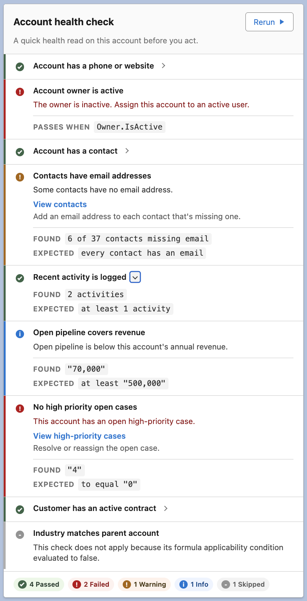

# Record Health Check

[](LICENSE)
[](https://github.com/gkolan/RecordHealthCheck/actions/workflows/ci.yml)
[](sfdx-project.json)
[](https://githubsfdeploy.herokuapp.com/?owner=gkolan&repo=RecordHealthCheck&ref=main)

Record Health Check is a metadata-driven framework for running data-quality checks against a Salesforce record, right on its **record page**. It is **advisory** and read-only, so it never blocks a save and never writes a field. You define **Check Sets** and **Rules** in Custom Metadata; the framework evaluates the open record, and the card shows each result as **Pass**, **Fail**, **Skipped**, or **Unable to Check** — with a failing check flagged by severity as **Error**, **Warning**, or **Info**.

Because it runs at read time rather than save time, it can evaluate across related records, compare aggregates, and surface data that predates your rules. It does not stop a save — use validation rules, Flow, or Apex triggers when the requirement is to block one. A failing check can also offer an optional read-only **"Fix it" link** and fix instructions.

## Demo

<table>
  <tr>
    <td width="58%" valign="top">
      <p>The card reports each check as a row:</p>
      <ul>
        <li><b>Passed</b> checks collapse to a single line.</li>
        <li><b>Failed</b> checks explain what is wrong and can show a <b>"Fix it"</b> link with instructions.</li>
        <li><b>Warning</b> and <b>Info</b> rows flag lower-severity issues, from "worth a look" down to "just so you know."</li>
        <li><b>Skipped</b> checks say why they did not apply to this record.</li>
        <li>Any row can reveal <b>Found / Expected</b> detail and the rule behind it.</li>
      </ul>
      <p>The footer tallies <b>Passed / Failed / Warnings / Skipped</b> at a glance, and <b>Rerun</b> re-evaluates on demand.</p>
      <p>You choose when it runs: automatically as the page loads, or on demand when the user clicks <b>Run</b>.</p>
      <p>Every row is a <b>check</b> you author declaratively in metadata, so you add or retune checks without touching the component.</p>
      <p>Checks are grouped into a <b>check set</b> per object. This example is an Account, but the same card drops onto any object's record page.</p>
      <!-- Video walkthrough: replace the line below with
           <p><sub>▶ <a href="https://youtu.be/YOUR_VIDEO_ID">Watch the two-minute walkthrough</a></sub></p> -->
      <p><sub>▶ <a href="https://github.com/gkolan/RecordHealthCheck/blob/main/docs/assets/img/Account_Health_Check_Quick_Demo.gif" target="_blank">See it in motion (animated GIF)</a></sub></p>
    </td>
    <td width="42%" valign="top">
      
      <p align="center"><sub>The card above is the <b>Example - Account 360 Health Check</b> set. Its checks read across the account's contacts, opportunities, cases, contracts, and activities, and one links to a report filtered to this account.</sub></p>
    </td>
  </tr>
</table>

## Install

Install into a **sandbox** first. Pick whichever path fits you — all three deploy the same `force-app` source.

> [!IMPORTANT]
> **Upgrading to v1.2.0 from an earlier release:** v1.2.0 removes the old Lightning component properties `configName` and `comparisonDisclosure`. Before deploying the upgrade to an org that already has Record Health Check on record pages, open those pages in Lightning App Builder, remove or reconfigure the old component placement, and save it with the current **Check Set** picker. After deployment, verify the selected Check Set still matches the page object.

v1.2.0 also moves comparison diagnostic details to **browser-console diagnostics only** (F12, for admins with `Record_Health_Check_View_Details`), replaces the removed `Record_Health_Check_Debug` permission with `Record_Health_Check_View_Details`, and selects the Check Set from a metadata-backed **dropdown** in App Builder instead of free text.

**Option 1 — Deploy button (no command line).** Click **[Deploy to Salesforce](https://githubsfdeploy.herokuapp.com/?owner=gkolan&repo=RecordHealthCheck&ref=main)**, log in to your sandbox, and click Deploy.

**Option 2 — Salesforce CLI.**

```bash
git clone https://github.com/gkolan/RecordHealthCheck.git
cd RecordHealthCheck
sf project deploy start --source-dir force-app
sf org assign permset --name Record_Health_Check_User
```

**Option 3 — Change set or DevOps Center.** Deploy the `force-app` folder through a change set, DevOps Center, or your deployment tool of choice.

### After installing

Assign the **`Record_Health_Check_User`** permission set, add the **recordHealthCheck** component to a Lightning record page, and choose a **Check Set** in App Builder. Use `Example_Account_360_Health_Check` for the card shown above, or `Account_Data_Quality` for a lighter set of four Account-field checks.

Full walkthrough: [First 10 Minutes](docs/start/first-10-minutes.md)

## What You Get

- Lightning record-page card
- Custom Metadata configuration
- Formula, SOQL, compare-two-SOQL, and Apex checks
- Guided remediation: optional "Fix it" deep links and fix instructions on failing checks
- Sample Account Check Sets for learning
- User and Admin Permission Sets

## Documentation

Open only the page you need.

- Learn the concepts: [Admin Quick Start](docs/installation/admin-quick-start.md)
- Create your first Rule: [Getting Started](docs/installation/getting-started.md#step-4-create-your-first-rule)
- Copy an example: [Examples catalog](docs/examples/index.md)
- Add a "Fix it" link: [Action Links and Fix Instructions](docs/guides/action-links.md)
- Full field reference: [Configuration Guide](docs/guides/configuration-guide.md) or [Apex plugin reference](docs/apex/plugin-reference.md)

## Example Library

Start with one example. Use the full library when you need another pattern:

- [Formula examples](docs/examples/index.md#formula)
- [SOQL single-query examples](docs/examples/index.md#soql-single-query)
- [SOQL compare-two-queries examples](docs/examples/index.md#soql-compare-two-queries)
- [Apex examples](docs/examples/index.md#apex)
- [Sample Check Set packages](docs/examples/index.md#sample-check-set-packages)

## Local Checks

For contributors:

```bash
npm run prettier:verify
npm run lint
npm test
npm run test:unit:coverage
```

Apex changes also need a validation deployment or org test run before release.

## License

Licensed under the [Apache License, Version 2.0](LICENSE). See [NOTICE](NOTICE) for attribution.
