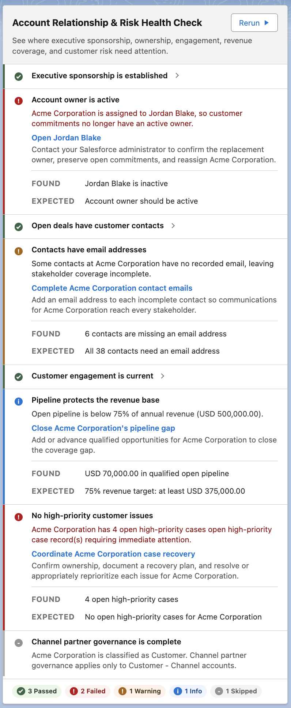

# Record Health Check

[](LICENSE)
[](sfdx-project.json)
[](https://github.com/gkolan/RecordHealthCheck/actions/workflows/ci.yml)
[](https://githubsfdeploy.herokuapp.com/app/githubdeploy/gkolan/RecordHealthCheck)

> **Make informed decisions before taking action on Salesforce data.**
>
> Record Health Check evaluates Salesforce records directly on the record page, surfacing what
> needs attention, why it matters, and how to resolve it without modifying the record or blocking
> users.

Every Rule returns **Pass**, **Fail**, **Skipped**, or **Unable to Check**. When a record needs
attention, the card can show its **Critical**, **Warning**, or **Info** severity; explain what was
**Found** and **Expected**; and provide fix instructions with an optional read-only **Fix it** link.

Administrators define **Check Sets** and **Rules** in Custom Metadata. The Framework evaluates them
at read time, so one card can review the current record, related records, aggregate results, and
data that existed before the Rules were created, without writing to the record.

> [!NOTE]
> Record Health Check provides advisory guidance; it never blocks a save. When Salesforce must
> prevent a record change, use a Validation Rule, Flow, or Apex trigger instead.

## Demo

<table>
  <tr>
    <td width="48%" valign="top">
      <p><b>Example:</b><br /><b>Account Relationship &amp; Risk Health Check</b></p>
      <p>An account team can review relationship strength, ownership, engagement, revenue coverage, and customer risk without leaving the record page.</p>
      <ul>
        <li><b>Review the whole relationship.</b> Rules evaluate the Account together with Opportunity Contact Roles, Contacts, Opportunities, Cases, Activities, ownership, and parent-account context.</li>
        <li><b>See business evidence.</b> Found and Expected values explain results such as three reachable Executive Sponsors, six contacts missing email, four high-priority cases, and a dynamically calculated 75% revenue-coverage target.</li>
        <li><b>Understand every outcome.</b> Passed Rules remain compact, issues include severity and corrective guidance, and skipped Rules explain the business reason they do not apply to this Account.</li>
        <li><b>Act on the risk.</b> Remediation guidance directs the account team toward the ownership, relationship, pipeline, or service action that closes the gap.</li>
      </ul>
      <p><b>Administrators control the experience</b></p>
      <ul>
        <li>Each check shown on the card is a Rule in the selected Check Set.</li>
        <li>Custom Metadata defines what each Rule evaluates, when it applies, and whether the card runs when the page opens or when the user selects <b>Run</b>.</li>
        <li>The same component can be configured for any Salesforce object with a record page.</li>
      </ul>
    </td>
    <td width="52%" valign="top">
      
    </td>
  </tr>
</table>

### What this example demonstrates

- **Formula checks** evaluate Account ownership and parent-account alignment.
- **Related-record and aggregate queries** measure executive sponsorship, contact reachability,
  pipeline coverage, and open customer issues.
- **Custom Apex** evaluates recent Tasks and Events within a configurable 90-day window.
- **Applicability rules** skip channel governance for a direct customer and explain why.

## Start here

Choose the path that matches where you are today. You do not need to read the documentation in
order.

| If you want to…                     | Start here                                                                |
| ----------------------------------- | ------------------------------------------------------------------------- |
| Understand the Framework            | [See how Record Health Check works](docs/installation/01-how-it-works.md) |
| Build a Check Set or Rule           | [Learn from a working example](docs/examples/README.md)                   |
| Find configuration or API specifics | [Search the documentation](docs/README.md)                                |

## Install

Start in a **sandbox**. The deployment installs the Framework and the clearly prefixed `Example_`
Check Set, Rules, and Apex evaluator. It does not create Acme demo records in an existing org;
those deterministic records are provisioned only by the dedicated scratch-org setup script.

> [!NOTE]
> **Upgrading an existing installation?** This release uses updated Custom Metadata field API
> names. Review the [upgrade guide](docs/installation/04-upgrading.md) for the field mapping and
> upgrade steps.

### Deploy to a sandbox

[](https://githubsfdeploy-sandbox.herokuapp.com/app/githubdeploy/gkolan/RecordHealthCheck)

The button opens Salesforce authentication and starts the deployment. It deploys the
default package directory (`force-app`) only. Prefer the Salesforce CLI?

```bash
git clone https://github.com/gkolan/RecordHealthCheck.git
cd RecordHealthCheck
sf project deploy start --manifest manifest/package.xml
```

Always use the manifest (or an explicit `--source-dir force-app`) for installs. The
`integration-tests/` tree is CI fixture metadata and is not part of the product; see
[`integration-tests/README.md`](integration-tests/README.md).

### After installing

1. Assign the **`Record_Health_Check_User`** permission set.
2. [Create your first Check Set and Rule](docs/installation/03-create-your-first-rule.md) in
   Salesforce Setup.
3. Add the **recordHealthCheck** component to a Lightning record page.
4. Select the Check Set in Lightning App Builder, save the page, and activate it.

For the complete first-run demo used by this project, follow [Create the demo scratch org](docs/installation/05-create-rhc-scratch-org.md).

For permissions, verification, and other deployment methods, follow
[Install and verify](docs/installation/02-install-and-verify.md).

## What you get

Record Health Check gives administrators a configurable Framework and gives users focused guidance
without leaving the Salesforce record page.

| Framework capability           | What it gives your org                                                                                                                                                            |
| ------------------------------ | --------------------------------------------------------------------------------------------------------------------------------------------------------------------------------- |
| Lightning record-page card     | Runs the selected Check Set and presents each Rule result where users already work                                                                                                |
| Custom Metadata configuration  | Lets administrators define, review, and deploy Check Sets and Rules without changing the Lightning component                                                                      |
| Four Evaluation Types          | Checks the current record with Formula, related data with Query, two SOQL results with Compare two queries, or custom logic with Apex                                             |
| Guided remediation             | Explains failed Rules with fix instructions and, when useful, an optional read-only **Fix it** link                                                                               |
| SLDS 1 and SLDS 2 support      | Lets administrators choose the card's visual treatment for each placement in Lightning App Builder; see [Choose the card design system](docs/guides/choose-card-design-system.md) |
| User and Admin permission sets | Provides clear starting access for people who run health checks and administrators who configure the Framework                                                                    |

## Contributing

Planning to contribute? See [Contributing](.github/CONTRIBUTING.md) for local checks, testing requirements,
and pull request guidance.

## License

Licensed under the [Apache License, Version 2.0](LICENSE). See [NOTICE](NOTICE) for attribution.
